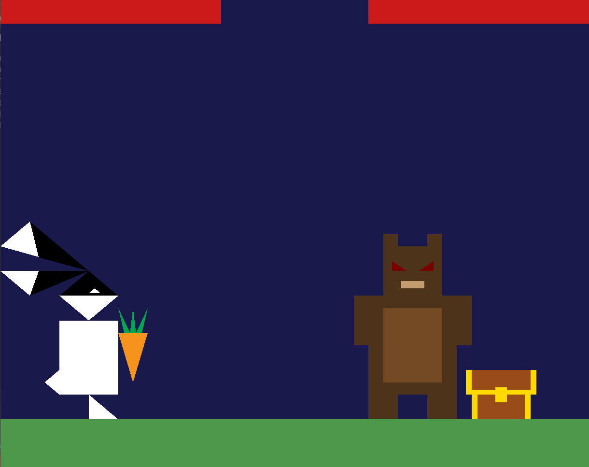
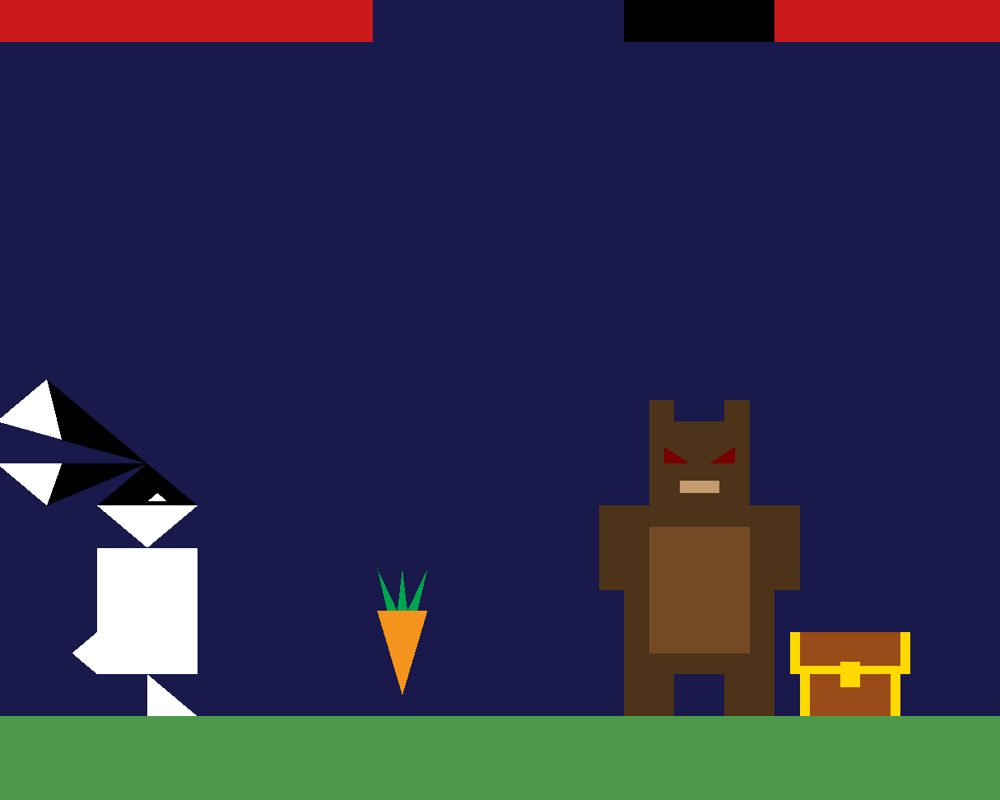
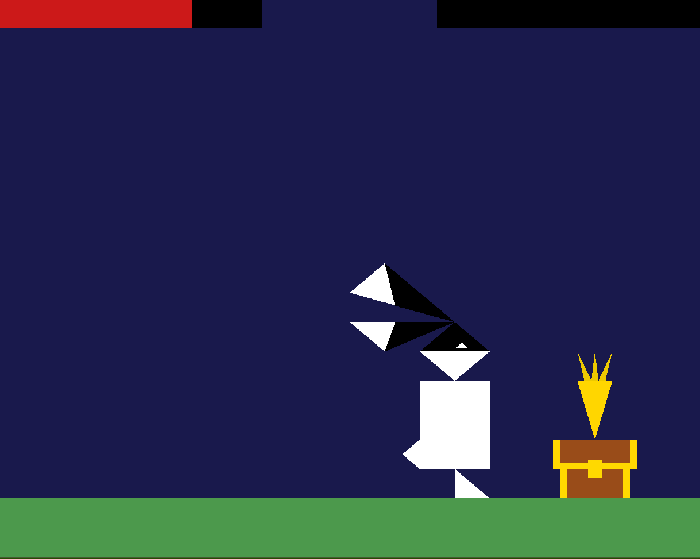

# Bunny Heist - A 2D OpenGL Based Game

## Overview
**Bunny Heist** is a 2D game built using OpenGL, where the player controls a clever bunny navigating a world filled with challenges and dangers to steal a precious treasure—the Golden Carrot. Along the way, players must outsmart a bear guarding the treasure.

## Features

### Animation
- The game incorporates animation through the bunny’s jumping mechanic (pressJump) and carrot-shooting movement (pressShoot).
- Jump physics are handled using **velocity (jumpVelocity)** and **gravity (gravity_jump)**, giving the movement a realistic, smooth, and dynamic feel.

### Custom Algorithms
- **Collision Detection**: A custom algorithm detects when the carrot hits the bear (`if (carrotPosition.x >= position2.x)`). This reduces the bear's health by 20 (`bearHealth -= 20`) and modifies the bear's health bar position (`position9.x += 0.15`).
- **Bear Collision**: If the bunny touches the bear, it is sent back to its starting position, and the bunny’s health decreases by 25%, reflecting the bear’s power.
- **Transformation Matrices**: Using **GLM**, transformation matrices handle translations, rotations, and scaling of objects dynamically.

### User Input Handling
- Player input is captured via the keyboard (arrow keys for movement, spacebar for throwing carrots).
- The bunny’s horizontal movement is restricted to boundaries using **glm::clamp** to ensure it stays within the game area.

### Game Assets and Types
- Various shapes are used to create the game environment, including:
  - **Triangles** for the bunny.
  - **Rectangles** for the body and feet.
  - Additional dynamic objects created using OpenGL primitives.

### Dynamic Colors
- Dynamic colors distinguish different object states (e.g., the bear’s eyes, the mask, etc.), adding to the visual feedback of the game.

### Treasure Unlock
- When the bear’s health reaches zero, the bunny touches the treasure, and the bear disappears.
- The **Golden Carrot** then appears, signifying the player's victory.
